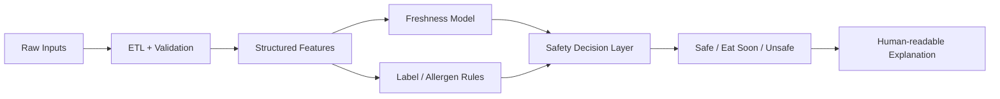

# Smart Food Safety & Freshness Scoring System

> A product-oriented decision-support prototype combining data engineering, machine learning and deterministic safety rules to produce transparent food freshness and risk signals.

[](https://www.python.org/)
[](https://github.com/Kaviya-Mahendran/smart-food-safety-system)

## Why this project exists

Food safety decisions are often reduced to a binary expiry-date check. This prototype explores a richer approach using continuous freshness scoring, structured safety rules, and explainable signals.

This is a **decision-support prototype**, not a replacement for food-safety regulation or expert judgement.

## System architecture



## Core capabilities

- ETL and input validation
- Freshness feature engineering
- ML-based freshness scoring
- Deterministic safety rules and overrides
- OCR/NLP-inspired expiry-label parsing
- Allergen detection
- Explainable feature contribution tracing
- Consumer and marketplace-oriented decision outputs

## Responsible AI and safety

- Safety rules can override model outputs.
- Allergen detection is explicit and conservative.
- Synthetic/anonymised data is used for modelling.
- Outputs are intended as decision support.
- Feature importance describes model behaviour, not causality.

## Repository structure

```text
smart_food_safety_system/
├── etl_pipeline/
├── freshness_scoring_model/
├── smart_label_scanner/
├── allergen_detection/
├── surplus_food_marketplace/
├── docs/
└── README.md
```

## Evaluation

The repository contains example inputs and outputs demonstrating system behaviour. Formal model evaluation should be reported with reproducible metrics and a clearly documented dataset split before deployment claims are made.

### Evaluation checklist

| Area | Current approach |
|---|---|
| Data | Example / synthetic or anonymised inputs |
| Model | Freshness scoring workflow |
| Rules | Deterministic safety and allergen checks |
| Explainability | Feature contribution tracing |
| Deployment claim | Not production validated |

No performance number is presented unless it can be reproduced from the repository.

## Reproduce locally

```bash
git clone https://github.com/Kaviya-Mahendran/smart-food-safety-system.git
cd smart-food-safety-system
pip install -r requirements.txt
```

Run the project components using the repository's documented scripts/notebooks.

## Engineering & safety considerations

A production implementation would require validated food-domain datasets, formal safety requirements, independent domain review, calibration/uncertainty analysis, monitoring, access controls and a documented risk-management process.

## Future roadmap

- Formal benchmark dataset and evaluation protocol
- Model calibration and uncertainty estimates
- Automated data-quality tests
- Containerised deployment
- API layer
- Model and data drift monitoring
- Expanded food-category validation

**Focus:** applied ML · data engineering · explainable AI · decision support · responsible analytics